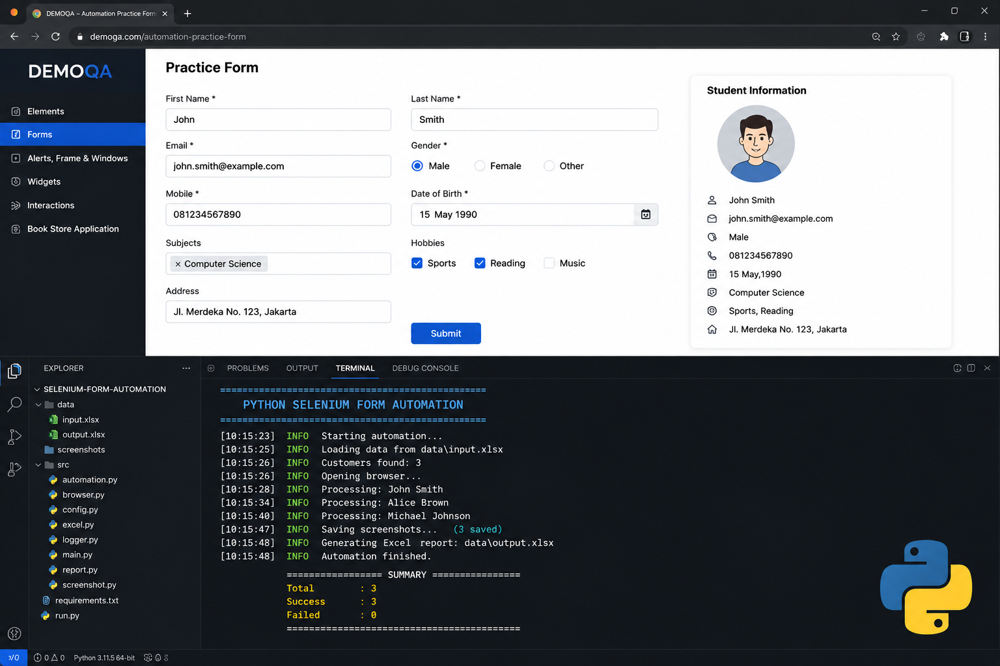
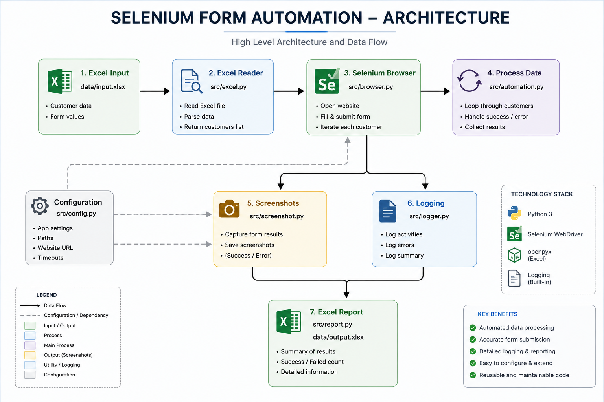
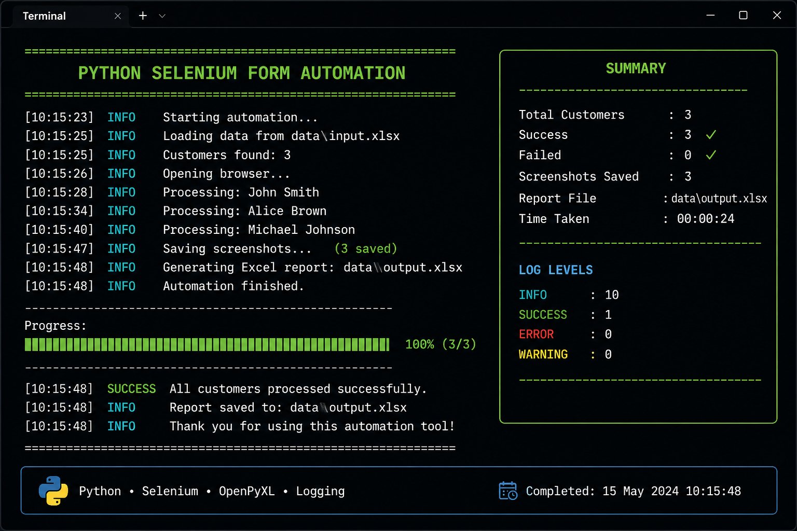

# 🚀 Python Selenium Form Automation

<div align="center">


**Professional Python Selenium Automation with Excel Integration, Logging, Screenshots, and Reporting**

</div>

---

# 📸 Project Demo



---

# 📖 Overview

This project demonstrates a complete Selenium automation workflow using Python.

The automation reads customer information from an Excel file, opens a web browser, automatically fills an online form, captures screenshots, generates execution logs, and exports a final Excel report.

This project follows a modular architecture similar to real-world automation projects used in software companies.

---

# ✨ Features

✅ Read customer data from Excel

✅ Automated browser interaction using Selenium

✅ Fill web forms automatically

✅ Capture screenshots

✅ Generate execution logs

✅ Export automation report to Excel

✅ Modular Python architecture

✅ Easy to extend

---

# 🏗 Project Architecture



Workflow:

```

Excel Input
↓

Read Data

↓

Open Browser

↓

Fill Form

↓

Capture Screenshot

↓

Generate Logs

↓

Generate Excel Report

```

---

# 💻 Console Output



The application provides:

- Real-time progress
- Customer processing status
- Logging information
- Success / Failed summary
- Execution statistics

---

# 📁 Project Structure

```

selenium-form-automation
│
├── data/
│ ├── input.xlsx
│
├── screenshots/
│ ├── automation-demo.png
│ ├── architecture.png
│ └── terminal-output.png
│
├── src/
│ ├── automation.py
│ ├── browser.py
│ ├── config.py
│ ├── excel.py
│ ├── logger.py
│ ├── report.py
│ ├── screenshot.py
│ └── main.py
│
├── requirements.txt
├── run.py
└── README.md

```

---

# ⚙ Technologies

| Technology | Usage |
|------------|------------------------|
| Python | Core Programming |
| Selenium | Browser Automation |
| OpenPyXL | Excel Processing |
| Logging | Execution Log |
| ChromeDriver | Browser Driver |
| Git | Version Control |
| GitHub | Source Code Repository |

---

# ▶ Installation

Clone repository

```bash
git clone https://github.com/danusetiawan14/selenium-form-automation.git

cd selenium-form-automation
```

Install dependencies

```bash
pip install -r requirements.txt
```

Run application

```bash
python run.py
```

---

# 📊 Input Example

The automation reads customer information from

```

data/input.xlsx

```

Example:

| First Name | Last Name | Email |
|------------|-----------|------------------|
| John | Smith | john@gmail.com |
| Alice | Brown | alice@gmail.com |
| Michael | Johnson | michael@gmail.com |

---

# 📈 Output

After execution the application generates

```

screenshots/

logs/

data/output.xlsx

```

---

# 🔥 Why This Project?

This project demonstrates practical skills in

- Python Development
- Selenium Automation
- Excel Processing
- Browser Automation
- Logging
- Error Handling
- Clean Code
- Modular Programming

---

# 👨‍💻 Developer

**Danu Setiawan**

Python Backend Developer

📍 Bogor, Indonesia

📧 danusetiawan140281@gmail.com

GitHub

https://github.com/danusetiawan14

LinkedIn

https://linkedin.com/in/danu-setiawan-0443b338a

Portfolio

https://danusetiawan14.github.io/portfolio-website/

---

# ⭐ Future Improvements

- Multiple browser support
- Docker container
- Headless mode
- HTML Report
- PDF Report
- Parallel execution
- CI/CD using GitHub Actions

---

## Business Use Cases

- Customer Registration Automation
- HR Form Automation
- Insurance Form Processing
- CRM Data Entry
- QA Testing
- Internal Office Automation

# 📜 License

MIT License
